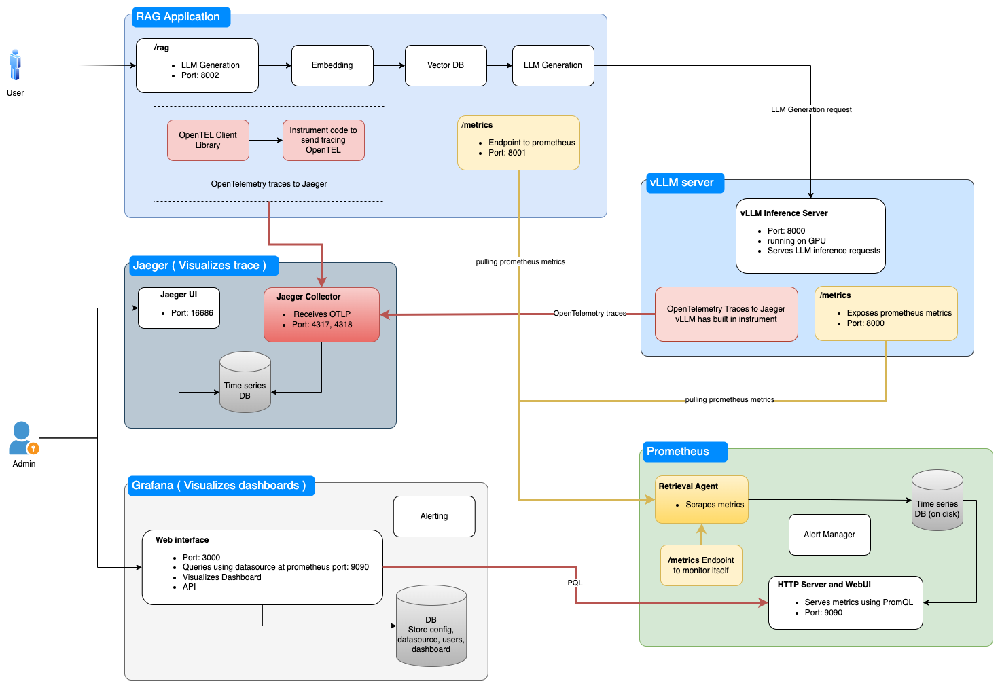
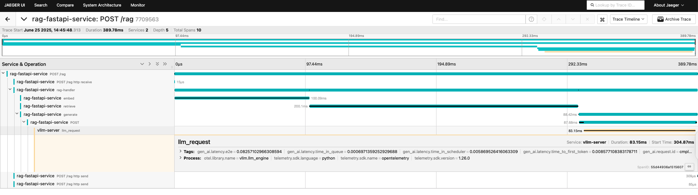
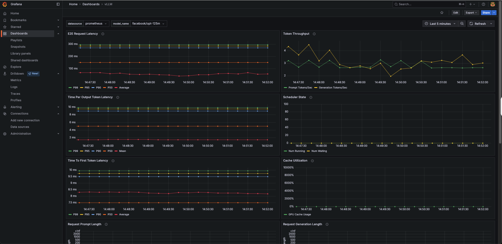

# vLLM Observability

**Monitor, trace, and optimize Large Language Model (LLM) deployments** using [vLLM](https://github.com/vllm-project/vllm) with full observability powered by **OpenTelemetry**, **Jaeger**, **Prometheus**, and **Grafana** — all containerized and easy to launch with Docker Compose.

> Gain visibility into token usage, latency, throughput, and system-level behavior across your LLM pipeline — all with zero friction.

I have written a blog about vLLM observablity, you can follow it [here](https://medium.com/@himadricuet/a2f4924d3949)

---

## Features

* **vLLM Inference** (`facebook/opt-125m` small good for testing)
* **RAG-style FastAPI App** with Prometheus metrics and Jaeger tracing
* **Prometheus** for metrics collection
* **Jaeger** for distributed tracing
* **Grafana** dashboards pre-configured
* Docker Compose for one-command deployment
* OpenTelemetry-based instrumentation

---

## Observability Architecture



## Project Structure

```sh
.
├── docker-compose.yml
├── prometheus.yml
├── rag-app/
│   ├── Dockerfile
│   └── app.py
├── vllm-server/
│   └── Dockerfile
└── grafana/
    ├── provisioning/
    │   ├── datasources/
    │   │   └── prometheus.yml
    │   └── dashboards/
    │       └── dashboard.yml
    └── dashboards/
        ├── vllm-dashboard.json
        └── rag-dashboard.json
```

---

## Observability Overview

| Tool              | Purpose                                   |
| ----------------- | ----------------------------------------- |
| **OpenTelemetry** | Collects traces and metrics               |
| **Prometheus**    | Scrapes metrics from `/metrics` endpoints |
| **Jaeger**        | Visualizes request traces                 |
| **Grafana**       | Displays dashboards for vLLM and RAG app  |

---

## Getting Started

### Prerequisites

* [Docker](https://www.docker.com/products/docker-desktop)
* [Docker Compose](https://docs.docker.com/compose/install/)

### Launch the Stack

```sh
git clone git@github.com:hitalukder/mlops.git
cd mlops/vLLM/observability
docker compose up -d
```

### Access the Services

| Component         | URL                                                                           |
| ----------------- | ----------------------------------------------------------------------------- |
| RAG App API       | [http://localhost:8002](http://localhost:8002)                                |
| vLLM Server       | [http://localhost:8000](http://localhost:8000)                                |
| Prometheus        | [http://localhost:9090](http://localhost:9090)                                |
| Jaeger UI         | [http://localhost:16686](http://localhost:16686)                              |
| Grafana Dashboard | [http://localhost:3000](http://localhost:3000) (user: `admin`, pass: `admin`) |

---

## Sample Use Case

> This stack showcases end-to-end tracing and monitoring for a mocked RAG pipeline.

A typical trace spans:
**`rag-app → embedding (mocked) → vector DB (mocked) → LLM generation → vllm-server`**
Each service and component is visualized as a **trace span** in Jaeger, providing full visibility.



-> Grafana dashboard, showing vLLM server metrics



---

### Stop the services

```sh
docker compose down --volumes
```

---

## Best Practices for Production

* **Persistent Storage:** Mount volumes for Prometheus and Grafana to preserve metrics and dashboard configs across restarts.
* **Security:** Change default passwords, secure network access, and consider HTTPS for all UIs.
* **Scalability:** For large deployments, explore distributed Prometheus (Thanos, Mimir) and scalable Jaeger backends (Elasticsearch, Cassandra). Use an OpenTelemetry Collector for robust ingestion.
* **Alerting:** Set alerts in Grafana to detect high latency, error spikes, or low throughput and notify your team proactively.
* **Centralized Logging:** Complement metrics and tracing with logging solutions like ELK or Loki for deeper debugging.
* **Advanced Observability:** Integrate modern LLM-focused tools such as Langsmith, Helicone, Instana, or traceloop to enhance your AI observability.

---

## Community & Contributions

We welcome contributions!
Feel free to fork, clone, and submit PRs or open issues for:

* New Grafana dashboards
* Support for other LLMs or frameworks
* Improved tracing instrumentation
* Documentation updates

---

## Resources

* [vLLM GitHub](https://github.com/vllm-project/vllm)
* [OpenTelemetry](https://opentelemetry.io/)
* [Jaeger](https://www.jaegertracing.io/)
* [Prometheus](https://prometheus.io/)
* [Grafana](https://grafana.com/)

---
